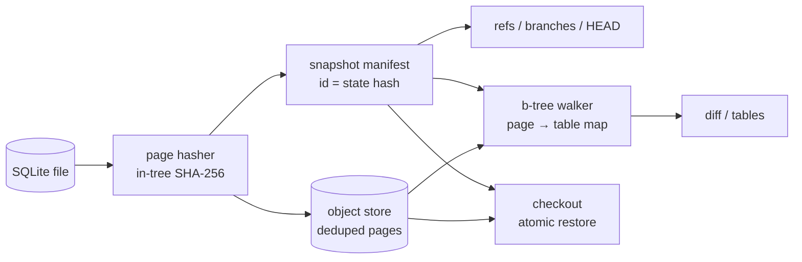

# litegraft

[English](README.md) | [中文](README.zh.md) | [日本語](README.ja.md)

[](LICENSE) [](Cargo.toml) [](CHANGELOG.md)  [](CONTRIBUTING.md)

**SQLite データベースファイルを瞬時にブランチ・スナップショット・差分比較するオープンソースツール——ページ単位、コンテンツアドレス、オフライン動作、サーバー不要、SQL レイヤー不要。**


```bash
git clone https://github.com/JaydenCJ/litegraft.git && cargo install --path litegraft
```

> プレリリース版：crates.io には未公開。上記ワンライナーで数秒でソースからビルドできます。ランタイム依存ゼロ——バイナリは標準ライブラリのみで構成されています。

## なぜ litegraft？

Neon はデータベースブランチを愛されるワークフローにしました——ただしクラウドの Postgres 向けに。SQLite 開発者（そして増え続けるコーディングエージェント）は、作業ツリーにある fixture で同じ体験を求めています：マイグレーションを試し、テスト DB をエージェントに任せ、実際に何が変わったかを正確に比較し、コマンド一つでクリーンなベースラインへ戻る。今日それはファイル全体のコピー（`cp`、`.backup`、`VACUUM INTO`）を意味し、コストは DB サイズに比例し、しかも*何が*変わったかは何も分かりません。litegraft は SQLite ファイルフォーマットそのものの上で動きます：データベースをページ単位でハッシュ化してコンテンツアドレスストアに収めるため、スナップショットのコストは前回から変化したページ分だけ、ブランチは名前付きポインタにすぎず、リストアはバイト単位で一致するアトミックなリネーム、差分は b-tree を走査してテーブルごとに報告——SQL 接続もサーバーもネットワークも一切不要です。

|  | litegraft | `cp` / `.backup` / `VACUUM INTO` | git（db をバイナリ blob としてコミット） | Litestream |
|---|---|---|---|---|
| スナップショットのコスト | 変化したページのみ（ミリ秒） | 毎回ファイル全体をコピー | コミットごとに圧縮 blob 全体 | WAL の継続ストリーミング |
| ブランチ + 切り替え | 名前付きポインタ、コマンド一つ | 手作業のファイル管理 | ファイル全体の checkout | ブランチツールではない |
| 何が変わったかの差分 | テーブル単位、b-tree 走査 | なし | バイナリ blob が変わったことだけ | なし |
| リストア | バイト単位一致、アトミックなリネーム | コピーで戻す | バイト単位一致 | 新ファイルへ再生 |
| サーバー / デーモン | 不要 | 不要 | 不要 | 常駐デーモン |
| 追加依存 | なし（標準ライブラリのみのバイナリ） | なし | git | 通常 S3 互換ストレージ |
| 履歴の完全性 | `verify` が全ページを再ハッシュ | なし | `git fsck` | レプリカのチェックサム |

<sub>2026-07 時点で各ツールの公式ドキュメント上の挙動に基づく評価です。Litestream は本来の目的（レプリケーションによる災害復旧）では極めて優秀——単にローカルのブランチ/差分ツールではないというだけです。</sub>

## 機能

- **スナップショットは変化分だけのコスト** —— 各ページは SHA-256 をキーに一度だけ保存。小さなマイグレーション後に 22 ページの fixture を再スナップしても書くのは 7 ページ・数ミリ秒、無変更 DB のスナップは無償の no-op です。
- **ブランチはポインタ、リストアはアトミック** —— `checkout` は任意のスナップショットを一時ファイル + リネームでバイト単位一致のファイルとして実体化し、古い `-wal`/`-shm`/`-journal` サイドカーを除去。未スナップの作業状態は `--force` と明示しない限り絶対に破棄しません。
- **差分が語るのは schema であってバイトオフセットではない** —— b-tree ウォーカーが全ページを所有者（テーブル、インデックス、`sqlite_schema`、オーバーフローチェーン、freelist、ポインタマップ）へ帰属させるため、`diff` はページ番号の羅列ではなく `users: 6 pages changed` と報告。過去のスナップショット同士の差分では作業ファイルに一切触れません。
- **コーディングエージェントのための設計** —— 全コマンドが db パスを引数に取り、本物の終了コードを返し、`--json` を話します。`snap` → エージェントに実行させる → `diff --json` → `checkout --force` という予測可能な 3 コマンドでループが閉じます。
- **陳腐化に対して正直** —— `fixtures.db-wal` に未チェックポイントのフレームがある、あるいはホットなロールバックジャーナルが存在する場合、litegraft は実行を拒否して正確な修正手順（`PRAGMA wal_checkpoint(TRUNCATE);`）を表示し、古いファイルを黙ってスナップすることはありません。
- **信頼し、そして検証する** —— `verify` は保存済み全ページを再ハッシュし全 manifest id を再計算（id はコンテンツハッシュなので改ざんは必ず検出）。`gc` はどのスナップショットからも参照されないオブジェクトを削除します。
- **依存ゼロ、サービスゼロ** —— 標準ライブラリのみの単一 Rust バイナリ。ツリーのどこにも SQLite ドライバもハッシュ crate もネットワークコードもありません。

## クイックスタート

インストール（Rust 1.75+ が必要）：

```bash
git clone https://github.com/JaydenCJ/litegraft.git && cargo install --path litegraft
```

任意の SQLite データベースをスナップショット（ここでは [examples/](examples/README.md) の `fixtures.db`：ユーザー 500 件、注文 2000 件、インデックス 1 件）：

```bash
litegraft init fixtures.db
litegraft snap fixtures.db -m "baseline fixture"
```

出力（実際の実行から採取）：

```text
snap 3b83d414bc5b (branch main)
  pages: 22 total, 22 new, 0 deduped (88.0 KiB written) in 2.9 ms
```

ブランチを切り、その上でリスキーなマイグレーションを実行し、何に触れたかを正確に確認して、元へ戻る：

```bash
litegraft branch fixtures.db try-migration
litegraft checkout fixtures.db try-migration
sqlite3 fixtures.db "UPDATE users SET plan='pro' WHERE id % 50 = 0"
litegraft snap fixtures.db -m "migration: plan column backfill"
litegraft diff fixtures.db main try-migration
litegraft checkout fixtures.db main
```

```text
snap 0296edbca9ca (branch try-migration)
  pages: 22 total, 7 new, 15 deduped (28.0 KiB written) in 3.5 ms
diff 3b83d414bc5b -> 0296edbca9ca
  sqlite_schema  1 changed
  users          6 changed
7 changed, 0 added, 0 removed (22 -> 22 pages x 4096 bytes)
checked out branch main at 3b83d414bc5b (22 pages restored)
```

ストアはデータベースの隣の `fixtures.db.litegraft/` に置かれます（すべて普通のファイル、フォーマットは [docs/store-format.md](docs/store-format.md) に記載）。`--store <dir>` で場所を変更可能。完全な実行可能スクリプトは [examples/](examples/README.md) を参照してください。

## コマンドリファレンス

| コマンド | 動作 |
|---|---|
| `init <db>` | データベースの隣にスナップショットストアを作成 |
| `snap <db> [-m <msg>]` | ページ単位デデュープのスナップショット。無変更なら no-op |
| `branch <db> [<name>]` | ブランチ一覧、または現在の head から分岐（`--at <ref>`） |
| `checkout <db> <ref>` | ファイルをバイト単位一致でリストアし HEAD を切り替え |
| `diff <db> [<ref> [<ref>]]` | テーブル帰属付きページ差分（デフォルトは head と作業ファイル） |
| `log <db>` / `status <db>` | ブランチ履歴 / 作業状態のクリーン・ダーティ |
| `tables <db> [<ref>]` | 任意の状態（現在・過去）のページ所有権の内訳 |
| `verify <db>` / `gc <db>` | ストア全体を再ハッシュ / 到達不能オブジェクトを削除 |

`<ref>` はブランチ名、スナップショット id（4 hex 文字以上の一意な前置でも可）、作業ファイルを表す `@` のいずれか。オプション：全レポート系コマンドの `--json`、他に `--store <dir>`、`--allow-wal`、`--force`、`--limit <n>`。

## スコープと保証

litegraft はファイルフォーマットを直接読み書きし、SQLite のロックは一切取得しません。したがって契約は「書き込み中でないときにスナップすること」。WAL とロールバックジャーナルのガードがよくある違反を捕捉し修正方法を提示します。`WITHOUT ROWID` テーブル、多段 b-tree、オーバーフローチェーン、freelist、auto-vacuum のポインタマップ、1 GiB のロックバイトページはすべて正しく帰属されます（本物の SQLite が生成したコミット済み fixture で検証済み）。0.1.0 の既知の制限：UTF-16 データベースは帰属処理で拒否されます。全ページを付け替える `VACUUM` をまたぐ差分は、意味があるふりをせずページサイズ/全面書き換えの不一致として正直に報告されます。スナップショットは DB ごとに独立で、DB 横断のデデュープはありません。

## アーキテクチャ



## ロードマップ

- [x] v0.1.0 —— ページ単位デデュープのスナップショット、アトミックかつバイト単位一致リストアのブランチ、b-tree 走査によるテーブル帰属差分、WAL/ジャーナルガード、ストアの verify + gc、JSON 出力、ローカルテスト 91 件 + smoke スクリプト
- [ ] 行レベル差分：変化したリーフページをデコードし、挿入/更新/削除されたレコードを表示
- [ ] WAL 対応スナップショット：拒否する代わりに未チェックポイントのフレームをマージ
- [ ] スナップショット保持：`gc` の上に `rm <ref>` と prune ポリシーを提供
- [ ] コールドスナップショット向けのオプションのオブジェクト圧縮
- [ ] schema リーダーの UTF-16 テキストエンコーディング対応

全リストは [open issues](https://github.com/JaydenCJ/litegraft/issues) を参照してください。

## コントリビュート

コントリビュート歓迎です—— [CONTRIBUTING.md](CONTRIBUTING.md) を読み、[good first issue](https://github.com/JaydenCJ/litegraft/issues?q=is%3Aissue+is%3Aopen+label%3A%22good+first+issue%22) から始めるか、[discussion](https://github.com/JaydenCJ/litegraft/discussions) を立ててください。このリポジトリは CI を同梱しません。上記のすべての主張は、ローカルでの `cargo test` と `scripts/smoke.sh`（`SMOKE OK` を表示すること）の実行で検証されています。

## ライセンス

[MIT](LICENSE)
