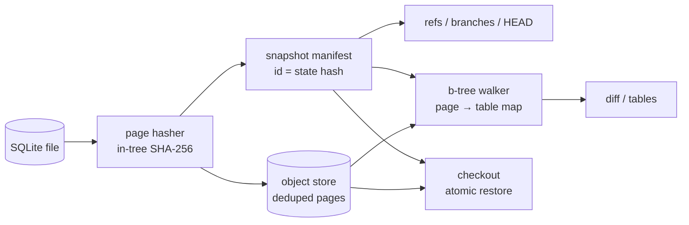

# litegraft

[English](README.md) | [中文](README.zh.md) | [日本語](README.ja.md)

[](LICENSE) [](Cargo.toml) [](CHANGELOG.md)  [](CONTRIBUTING.md)

**Open-source instant branch, snapshot and diff for SQLite database files — page-level, content-addressed, offline, no server, no SQL layer.**


```bash
git clone https://github.com/JaydenCJ/litegraft.git && cargo install --path litegraft
```

> Pre-release: not yet on crates.io; the one-liner above builds from source in seconds. Zero runtime dependencies — the binary is std-only.

## Why litegraft?

Neon made database branching a beloved workflow — for Postgres, in the cloud. SQLite developers (and, increasingly, their coding agents) want the same thing for the fixture sitting in the working tree: try a migration, let an agent loose on the test database, diff what actually changed, and get back to a pristine baseline in one command. Today that means copying whole files around (`cp`, `.backup`, `VACUUM INTO`), which scales with database size and tells you nothing about *what* changed. litegraft works on the SQLite file format itself: it hashes the database page by page into a content-addressed store, so a snapshot costs only the pages that changed since the last one, a branch is just a named pointer, a restore is a byte-identical atomic rename, and a diff walks the b-trees to report changes per table — all without opening a SQL connection, running a server, or touching the network.

|  | litegraft | `cp` / `.backup` / `VACUUM INTO` | git (db committed as a blob) | Litestream |
|---|---|---|---|---|
| Snapshot cost | changed pages only (ms) | full file copy, every time | full compressed blob per commit | continuous WAL streaming |
| Branch + switch | named pointers, one command | manual file juggling | full-file checkout | not a branching tool |
| What-changed diff | per table, via b-tree walk | none | binary blob changed | none |
| Restore | byte-identical, atomic rename | copy back | byte-identical | replays into a new file |
| Server / daemon | none | none | none | background daemon |
| Extra dependencies | none (std-only binary) | none | git | S3-compatible target (typically) |
| History integrity | `verify` re-hashes every page | none | `git fsck` | replica checksums |

<sub>Assessment as of 2026-07 against each tool's documented behavior; Litestream is superb at what it is for (disaster recovery via replication) — it simply is not a local branching/diff tool.</sub>

## Features

- **Snapshots cost only what changed** — every page is stored once under its SHA-256; re-snapshotting a 22-page fixture after a small migration writes 7 pages in a few milliseconds, and snapping an unchanged database is a free no-op.
- **Branches are pointers, restores are atomic** — `checkout` materializes any snapshot as a byte-identical file via temp-file + rename, removes stale `-wal`/`-shm`/`-journal` sidecars, and refuses to discard un-snapshotted work unless you say `--force`.
- **Diffs speak schema, not byte offsets** — a b-tree walker attributes every page to its owner (tables, indexes, `sqlite_schema`, overflow chains, freelist, pointer map), so `diff` says `users: 6 pages changed` instead of dumping page numbers; it diffs two historical snapshots without touching the working file.
- **Built for coding agents** — every command takes the db path, returns real exit codes, and speaks `--json`; the loop `snap` → let the agent run → `diff --json` → `checkout --force` is three predictable commands.
- **Honest about staleness** — if `fixtures.db-wal` holds uncheckpointed frames or a hot rollback journal exists, litegraft refuses and prints the exact fix (`PRAGMA wal_checkpoint(TRUNCATE);`) rather than silently snapshotting a stale file.
- **Trust, then verify** — `verify` re-hashes every stored page and recomputes every manifest id (ids are content hashes, so tampering is detectable); `gc` deletes objects no snapshot references.
- **Zero dependencies, zero services** — a single std-only Rust binary; no SQLite driver, no hash crate, no network code anywhere in the tree.

## Quickstart

Install (requires Rust 1.75+):

```bash
git clone https://github.com/JaydenCJ/litegraft.git && cargo install --path litegraft
```

Snapshot any SQLite database (here: `fixtures.db` from [examples/](examples/README.md) — 500 users, 2000 orders, one index):

```bash
litegraft init fixtures.db
litegraft snap fixtures.db -m "baseline fixture"
```

Output (captured from a real run):

```text
snap 3b83d414bc5b (branch main)
  pages: 22 total, 22 new, 0 deduped (88.0 KiB written) in 2.9 ms
```

Branch, run a risky migration on the branch, see exactly what it touched, then jump back:

```bash
litegraft branch fixtures.db try-migration
litegraft checkout fixtures.db try-migration
sqlite3 fixtures.db "UPDATE users SET plan='pro' WHERE id % 50 = 0"
litegraft snap fixtures.db -m "migration: plan column backfill"
litegraft diff fixtures.db main try-migration
litegraft checkout fixtures.db main
```

```text
snap 0296edbca9ca (branch try-migration)
  pages: 22 total, 7 new, 15 deduped (28.0 KiB written) in 3.5 ms
diff 3b83d414bc5b -> 0296edbca9ca
  sqlite_schema  1 changed
  users          6 changed
7 changed, 0 added, 0 removed (22 -> 22 pages x 4096 bytes)
checked out branch main at 3b83d414bc5b (22 pages restored)
```

The store lives in `fixtures.db.litegraft/` next to the database (plain files, documented in [docs/store-format.md](docs/store-format.md)); `--store <dir>` relocates it. See [examples/](examples/README.md) for the full runnable script.

## Command reference

| Command | What it does |
|---|---|
| `init <db>` | Create a snapshot store next to the database |
| `snap <db> [-m <msg>]` | Snapshot with page-level dedup; no-op if nothing changed |
| `branch <db> [<name>]` | List branches, or fork one at the current head (`--at <ref>`) |
| `checkout <db> <ref>` | Restore the file byte-identically and switch HEAD |
| `diff <db> [<ref> [<ref>]]` | Page diff attributed to tables (defaults to head vs working file) |
| `log <db>` / `status <db>` | Branch history / clean-or-dirty working state |
| `tables <db> [<ref>]` | Page-ownership breakdown of any state, live or historical |
| `verify <db>` / `gc <db>` | Re-hash the whole store / drop unreachable objects |

A `<ref>` is a branch name, a snapshot id (any unique prefix ≥ 4 hex chars), or `@` for the working file. Options: `--json` on every reporting command, `--store <dir>`, `--allow-wal`, `--force`, `--limit <n>`.

## Scope and guarantees

litegraft reads and writes the file format directly and never takes SQLite locks, so the contract is: snapshot when no writer is active. The WAL and rollback-journal guards catch the common violations and print the fix. `WITHOUT ROWID` tables, multi-level b-trees, overflow chains, freelists, auto-vacuum pointer maps and the 1 GiB lock-byte page are all attributed correctly (verified against a committed fixture generated by real SQLite). Known limits in 0.1.0: UTF-16 databases are rejected for attribution, diffs across a `VACUUM` (which renumbers every page) are reported as a page-size/full-rewrite mismatch rather than pretending to be meaningful, and snapshots are per-database — there is no cross-database dedup.

## Architecture



## Roadmap

- [x] v0.1.0 — page-dedup snapshots, branches with atomic byte-identical restore, table-attributed diffs via b-tree walking, WAL/journal guards, store verify + gc, JSON output, 91 local tests + smoke script
- [ ] Row-level diff: decode changed leaf pages and show inserted/updated/deleted records
- [ ] WAL-aware snapshots: merge uncheckpointed frames instead of refusing
- [ ] Snapshot retention: `rm <ref>` and prune policies on top of `gc`
- [ ] Optional object compression for cold snapshots
- [ ] UTF-16 text encodings in the schema reader

See the [open issues](https://github.com/JaydenCJ/litegraft/issues) for the full list.

## Contributing

Contributions are welcome — see [CONTRIBUTING.md](CONTRIBUTING.md), start with a [good first issue](https://github.com/JaydenCJ/litegraft/issues?q=is%3Aissue+is%3Aopen+label%3A%22good+first+issue%22) or open a [discussion](https://github.com/JaydenCJ/litegraft/discussions). This repository ships no CI; every claim above is verified by local runs of `cargo test` and `scripts/smoke.sh` (which must print `SMOKE OK`).

## License

[MIT](LICENSE)
