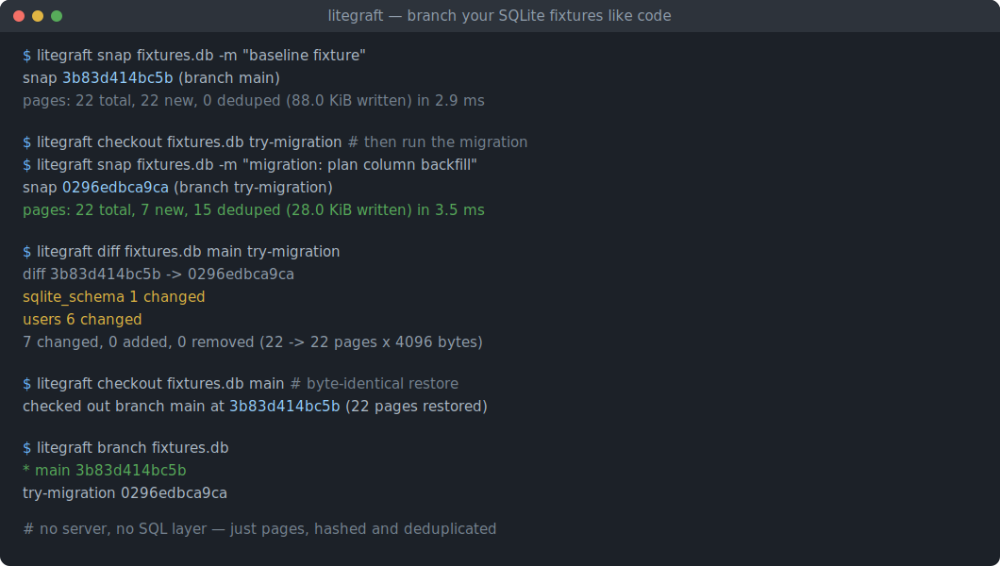
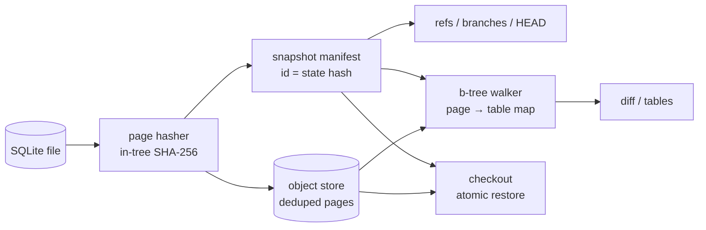

# litegraft

[English](README.md) | [中文](README.zh.md) | [日本語](README.ja.md)

[](LICENSE) [](Cargo.toml) [](CHANGELOG.md)  [](CONTRIBUTING.md)

**开源的 SQLite 数据库文件即时分支、快照与差异对比工具——页级、内容寻址、离线运行、无服务器、无 SQL 层。**



```bash
git clone https://github.com/JaydenCJ/litegraft.git && cargo install --path litegraft
```

> 预发布版：尚未发布到 crates.io；上面的一行命令几秒内即可从源码构建完成。零运行时依赖——二进制仅使用标准库。

## 为什么选择 litegraft？

Neon 让数据库分支成为一种深受喜爱的工作流——但那是面向云端 Postgres 的。SQLite 开发者（以及越来越多的编码智能体）希望在工作目录里的 fixture 上获得同样的体验：试跑一次迁移、放手让智能体操作测试数据库、精确对比到底改了什么，然后一条命令回到干净的基线。今天这意味着来回复制整个文件（`cp`、`.backup`、`VACUUM INTO`），开销随数据库大小线性增长，而且完全不知道*具体*改了什么。litegraft 直接工作在 SQLite 文件格式本身：它逐页哈希数据库并存入内容寻址仓库，因此一次快照只花费自上次以来变化的页，分支只是一个命名指针，恢复是逐字节一致的原子重命名，差异对比则通过遍历 b-tree 按表报告变化——全程不打开 SQL 连接、不运行服务器、不碰网络。

|  | litegraft | `cp` / `.backup` / `VACUUM INTO` | git（把 db 当二进制提交） | Litestream |
|---|---|---|---|---|
| 快照开销 | 仅变化的页（毫秒级） | 每次都是整文件复制 | 每次提交一个完整压缩 blob | 持续 WAL 流式复制 |
| 分支 + 切换 | 命名指针，一条命令 | 手工倒腾文件 | 整文件 checkout | 不是分支工具 |
| 变了什么的差异 | 按表，经 b-tree 遍历 | 无 | 只知道二进制 blob 变了 | 无 |
| 恢复 | 逐字节一致，原子重命名 | 复制回去 | 逐字节一致 | 重放到新文件 |
| 服务器 / 守护进程 | 无 | 无 | 无 | 后台守护进程 |
| 额外依赖 | 无（纯标准库二进制） | 无 | git | 通常需要 S3 兼容存储 |
| 历史完整性 | `verify` 重新哈希每一页 | 无 | `git fsck` | 副本校验和 |

<sub>以上为 2026-07 时依各工具官方文档行为所做的评估；Litestream 在它的定位（通过复制实现灾难恢复）上非常出色——它只是不是一个本地分支/差异工具。</sub>

## 功能特性

- **快照只花费变化的部分** —— 每一页按其 SHA-256 只存一次；小迁移后重新快照一个 22 页的 fixture 只写 7 页、几毫秒即可完成，对未变化的数据库快照则是免费的空操作。
- **分支是指针，恢复是原子的** —— `checkout` 通过临时文件 + 重命名把任意快照物化为逐字节一致的文件，顺带清除过期的 `-wal`/`-shm`/`-journal` 附属文件，且除非你明确 `--force`，绝不丢弃未快照的工作状态。
- **差异说的是 schema，不是字节偏移** —— b-tree 遍历器把每一页归属到其所有者（表、索引、`sqlite_schema`、溢出链、freelist、指针映射页），因此 `diff` 输出 `users: 6 pages changed` 而不是倾倒页号；对比两个历史快照时完全不触碰工作文件。
- **为编码智能体而生** —— 每条命令都以 db 路径为参数、返回真实退出码并支持 `--json`；`snap` → 放智能体去跑 → `diff --json` → `checkout --force` 三条可预测的命令就是完整闭环。
- **对陈旧状态绝对诚实** —— 如果 `fixtures.db-wal` 还有未 checkpoint 的帧、或存在热回滚日志，litegraft 会拒绝执行并打印确切的修复命令（`PRAGMA wal_checkpoint(TRUNCATE);`），而不是悄悄快照一个过期文件。
- **信任，然后校验** —— `verify` 重新哈希每个已存页并重算每个 manifest id（id 就是内容哈希，篡改必然暴露）；`gc` 删除不被任何快照引用的对象。
- **零依赖、零服务** —— 单个纯标准库 Rust 二进制；整个代码树里没有 SQLite 驱动、没有哈希 crate、没有任何网络代码。

## 快速上手

安装（需要 Rust 1.75+）：

```bash
git clone https://github.com/JaydenCJ/litegraft.git && cargo install --path litegraft
```

对任意 SQLite 数据库做快照（这里的 `fixtures.db` 来自 [examples/](examples/README.md)——500 个用户、2000 个订单、一个索引）：

```bash
litegraft init fixtures.db
litegraft snap fixtures.db -m "baseline fixture"
```

输出（取自真实运行）：

```text
snap 3b83d414bc5b (branch main)
  pages: 22 total, 22 new, 0 deduped (88.0 KiB written) in 2.9 ms
```

开分支、在分支上跑一次有风险的迁移、精确看到它碰了什么，然后跳回来：

```bash
litegraft branch fixtures.db try-migration
litegraft checkout fixtures.db try-migration
sqlite3 fixtures.db "UPDATE users SET plan='pro' WHERE id % 50 = 0"
litegraft snap fixtures.db -m "migration: plan column backfill"
litegraft diff fixtures.db main try-migration
litegraft checkout fixtures.db main
```

```text
snap 0296edbca9ca (branch try-migration)
  pages: 22 total, 7 new, 15 deduped (28.0 KiB written) in 3.5 ms
diff 3b83d414bc5b -> 0296edbca9ca
  sqlite_schema  1 changed
  users          6 changed
7 changed, 0 added, 0 removed (22 -> 22 pages x 4096 bytes)
checked out branch main at 3b83d414bc5b (22 pages restored)
```

仓库存放在数据库旁边的 `fixtures.db.litegraft/` 目录里（全是普通文件，格式见 [docs/store-format.md](docs/store-format.md)）；`--store <dir>` 可改存放位置。完整可运行脚本见 [examples/](examples/README.md)。

## 命令参考

| 命令 | 作用 |
|---|---|
| `init <db>` | 在数据库旁创建快照仓库 |
| `snap <db> [-m <msg>]` | 页级去重快照；无变化时为空操作 |
| `branch <db> [<name>]` | 列出分支，或在当前 head 派生新分支（`--at <ref>`） |
| `checkout <db> <ref>` | 逐字节一致地恢复文件并切换 HEAD |
| `diff <db> [<ref> [<ref>]]` | 按表归属的页差异（默认对比 head 与工作文件） |
| `log <db>` / `status <db>` | 分支历史 / 工作状态是否干净 |
| `tables <db> [<ref>]` | 任意状态（当前或历史）的页归属明细 |
| `verify <db>` / `gc <db>` | 重新哈希整个仓库 / 清除不可达对象 |

`<ref>` 可以是分支名、快照 id（≥ 4 个十六进制字符的唯一前缀即可）或代表工作文件的 `@`。选项：所有报告类命令支持 `--json`，另有 `--store <dir>`、`--allow-wal`、`--force`、`--limit <n>`。

## 范围与保证

litegraft 直接读写文件格式，从不获取 SQLite 锁，因此约定是：在没有写入者活动时做快照。WAL 与回滚日志守卫会拦截常见违规并打印修复方法。`WITHOUT ROWID` 表、多层 b-tree、溢出链、freelist、auto-vacuum 指针映射页和 1 GiB 锁字节页均能正确归属（已对照真实 SQLite 生成的提交内 fixture 验证）。0.1.0 的已知限制：UTF-16 数据库会被归属逻辑拒绝；跨 `VACUUM`（会重编所有页号）的差异会如实报告为页尺寸/整体重写不匹配，而不是假装有意义；快照按数据库隔离——没有跨数据库去重。

## 架构



## 路线图

- [x] v0.1.0 —— 页级去重快照、原子且逐字节一致恢复的分支、经 b-tree 遍历按表归属的差异、WAL/日志守卫、仓库 verify + gc、JSON 输出、91 个本地测试 + smoke 脚本
- [ ] 行级差异：解码变化的叶页，展示插入/更新/删除的记录
- [ ] WAL 感知快照：合并未 checkpoint 的帧而不是拒绝
- [ ] 快照保留策略：在 `gc` 之上提供 `rm <ref>` 与清理策略
- [ ] 冷快照的可选对象压缩
- [ ] schema 读取器支持 UTF-16 文本编码

完整列表见 [open issues](https://github.com/JaydenCJ/litegraft/issues)。

## 参与贡献

欢迎贡献——请阅读 [CONTRIBUTING.md](CONTRIBUTING.md)，从 [good first issue](https://github.com/JaydenCJ/litegraft/issues?q=is%3Aissue+is%3Aopen+label%3A%22good+first+issue%22) 入手，或发起一个 [discussion](https://github.com/JaydenCJ/litegraft/discussions)。本仓库不附带 CI；上述所有断言都由本地运行 `cargo test` 与 `scripts/smoke.sh`（必须打印 `SMOKE OK`）验证。

## 许可证

[MIT](LICENSE)
